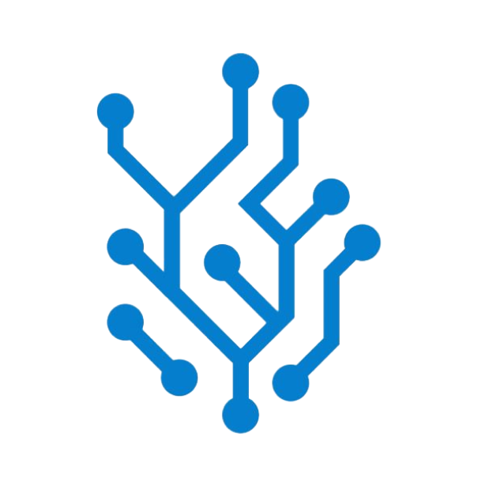
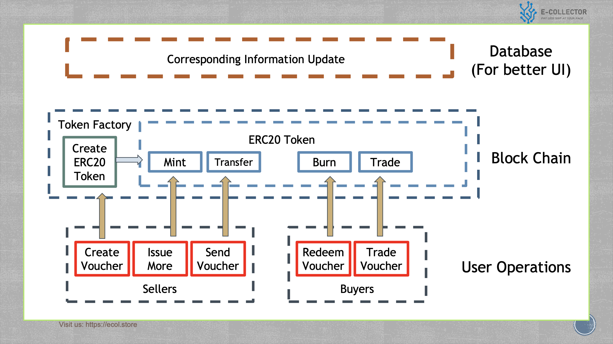
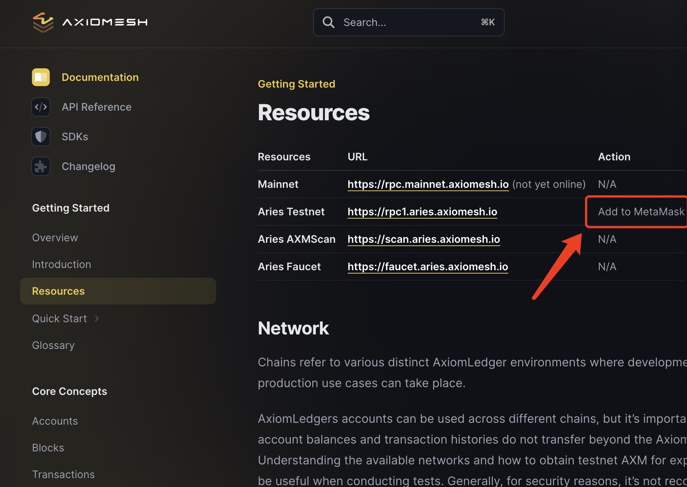
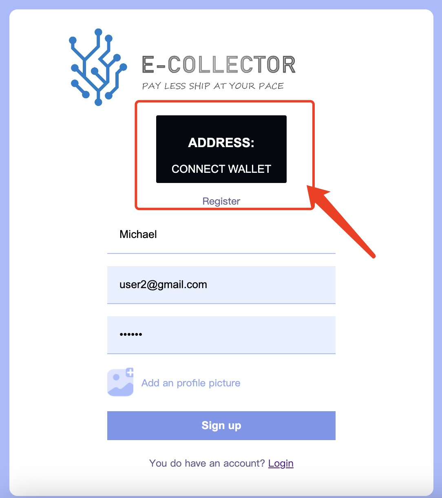

<a name="readme-top"></a>
<!-- PROJECT LOGO -->
<br />
<div align="center" >
  <a href="public/images/Logo.png">
    
  </a>


  <p align="center">Our Web 3.0 Project
    <br />
    <a href="https://ecol.store"><strong>Explore our Project »</strong></a>
    <br />
  </p>
</div>


<!-- Introducing E-Collector : The Future of E-commerce -->
## About The Project

### What is E-Collector?

E-Collector is a game-changer for both buyers and sellers!

It's a token that uses blockchain to let you buy goods now and get them as you like, anytime, anywhere!

It's not a coupon or a gift card. It's a digital asset that you can trade, transfer or gift as you wish!

It saves you time and money, improves the circulation of goods, and helps sellers earn more and keep customers happy!


### General Structure




### Our Smart Contract

Contract Link: [https://github.com/MichaelYang-lyx/Web3_contract](https://github.com/MichaelYang-lyx/Web3_contract)

<p align="right">(<a href="#readme-top">back to top</a>)</p>

### Quick start

_Below is an example of how you can instruct your audience on installing and setting up your app. This template doesn't rely on any external dependencies or services._

1. Install Metamask and register an account.
   
Metamask Link:[https://metamask.io/download/](https://metamask.io/download/)

3. Connect your Metamask Wallet to Axiomesh chain.
   
Axiomesh Resources Link:[https://docs.axiomesh.io/en/documentation/getting-started/resources/resources](https://docs.axiomesh.io/en/documentation/getting-started/resources/resources)


5. Get some visual money from Axiomesh Faucet.
   
Axiomesh Facucet Link:[https://faucet.aries.axiomesh.io/](https://faucet.aries.axiomesh.io/)   

6. Register your account in E-collector and experience it.

Just press the button to connect your wallet.


Then just enjoy it.

<p align="right">(<a href="#readme-top">back to top</a>)</p>

### Get Our Project Code

1. Clone the repo
   ```sh
   git clone https://github.com/MichaelYang-lyx/Web3.0_Project.git
   ```
2. Install NPM packages
   ```sh
   npm install
   ```
<p align="right">(<a href="#readme-top">back to top</a>)</p>

<!-- CONTACT -->
## Contact

Michael (MSc Big Data Tech in HKUST) - yyanggh@connect.ust.com 

Mark (IT developer) - woosts.me@gmail.com

Sam (MSc Financial Mathematic in HKUST) - sam.lin@connect.ust.hk

Project Link: [https://ecol.store](https://ecol.store)

<p align="right">(<a href="#readme-top">back to top</a>)</p>


